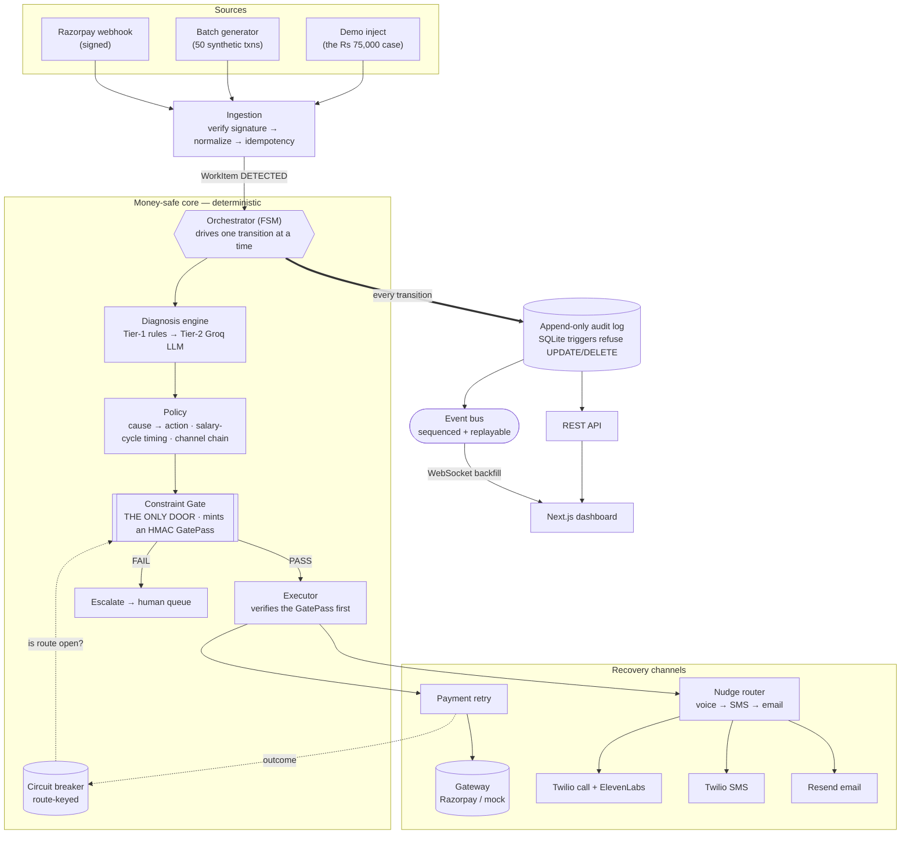
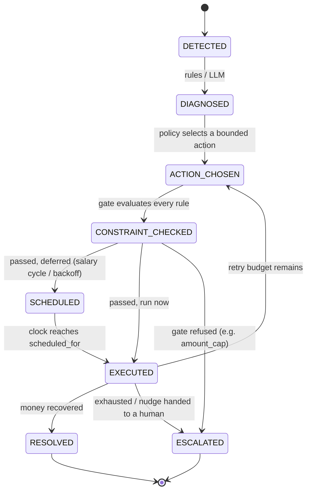

<div align="center">

# Recoup

**An autonomous, money-safe revenue-recovery agent for Razorpay merchants.**

Detect a failed payment → diagnose *why* it failed → run a **bounded** recovery action → prove every step with an immutable audit trail.

<br/>

<!-- Integrations -->


<!-- Core stack -->


<!-- Quality -->


</div>

---

## Table of contents

- [What Recoup does](#what-recoup-does)
- [The governing idea](#the-governing-idea)
- [Architecture](#architecture)
- [The recovery lifecycle](#the-recovery-lifecycle)
- [Money-safety invariants](#money-safety-invariants)
- [Tech stack — and where each piece is applied](#tech-stack--and-where-each-piece-is-applied)
- [Project structure](#project-structure)
- [Getting started](#getting-started)
- [Running it](#running-it)
- [API surface](#api-surface)
- [The diagnosis engine](#the-diagnosis-engine)
- [Recovery channels](#recovery-channels)
- [Testing & quality](#testing--quality)
- [Credentials](#credentials)
- [Documentation](#documentation)
- [Project status](#project-status)

---

## What Recoup does

Every merchant loses revenue to payments that *almost* worked — a card with no funds this
morning, a lapsed UPI mandate, a bank that was briefly down, a genuine soft decline. The
naïve fix is a blind retry loop, which annoys customers, hammers degraded banks, and
recovers little.

**Recoup is a root-cause router, not a retry loop.** For each failed payment it:

1. **Detects** the failure from a Razorpay webhook (or a synthetic batch / a demo injection).
2. **Diagnoses** *why* it failed — a deterministic rules table first, an LLM only for the
   ambiguous long tail.
3. **Decides** a single bounded action from the cause: schedule a retry near the salary
   cycle, back off behind a circuit breaker, nudge the customer by voice/SMS/email, or
   escalate to a human.
4. **Gates** that action through one constraint check — the only path to moving money — and
   **executes** it, or refuses and escalates.
5. **Proves** it: every transition is appended to an immutable audit log that reconstructs
   the entire run.

Three failed payments with three different causes visibly receive three different actions.
That is the whole pitch, and it is enforced in code, not asserted in a slide.

---

## The governing idea

> **Recovery is a state machine, not a chatbot.**
> The LLM *diagnoses*. The state machine *decides*. The constraint gate *guards*. The audit
> log *proves it*.

The LLM never moves money, never chooses an action, never overrides a cap. Its entire authority
is to return a `Diagnosis`. Everything downstream of that is deterministic and bounded — which
is what makes "every money action is safe" a property you can point a reviewer at, rather than
a promise.

---

## Architecture

Seven layers, each behind an interface, assembled by a deterministic orchestrator. Sources feed
one ingestion path; the money-safe core drives every work item to a terminal state; every
transition lands in the append-only audit log, which the API and the live dashboard read from.



**Two invariants are enforced mechanically, not by convention:**

1. **The audit log is physically append-only.** SQLite `BEFORE UPDATE`/`BEFORE DELETE` triggers
   `RAISE(ABORT)` on `audit_events`. A test issues a raw `UPDATE`/`DELETE` and watches the
   database refuse it.
2. **The gate is the only door.** `ActionExecutor.execute()` requires a `GatePass` — a frozen
   object carrying an HMAC only `ConstraintGate.check()` can mint. An AST architecture test walks
   the source and fails the build if any module outside the executor (and the sanctioned
   composition root) imports the recovery channels.

---

## The recovery lifecycle

Every work item is one row moving through a validated state machine. Only `RESOLVED` and
`ESCALATED` are terminal; no transition is ever emitted after them.



---

## Money-safety invariants

These hold everywhere, and most are enforced by the type system, the schema, or a test:

- The **LLM never moves money** — its only output is a `Diagnosis`.
- `ConstraintGate.check()` is the **single** path to executing any action.
- **Hard caps:** `retry_count ≤ 3`, `amount ≤ ₹50,000`, `fraud_flag == false` required — any
  breach escalates to a human.
- **Append-only audit:** `audit_events` rows are inserted, never updated or deleted.
- **Idempotency:** deduped on `event_id`; a webhook delivered twice never starts a second recovery.
- **Signature verification:** an unsigned or wrong-secret webhook is rejected before any parsing.
- **Money is integer paise**, never a float; the UI divides by 100 only at display.
- **Honest metrics:** every batch report includes the full exception list with reasons — no
  cherry-picking (a 100% recovery rate is treated as a bug, not a win).
- **Boots with an empty `.env`:** missing credentials degrade to mock implementations; the app
  never crashes for a missing key.

---

## Tech stack — and where each piece is applied

| Technology | Version | Where it's applied |
|---|---|---|
| **Python** | 3.13 | Backend language (pinned via `uv`) |
| **FastAPI** | 0.141+ | HTTP surface: signed webhook, REST, WebSocket |
| **Uvicorn** | 0.52+ | ASGI server |
| **Pydantic v2 / pydantic-settings** | 2.x | Domain models, validation, credential-optional config |
| **SQLAlchemy** | 2.0 | Storage layer — SQLite by default, Postgres-ready schema |
| **SQLite** | — | Append-only audit log + work-item store (one inspectable file) |
| **Groq** | `openai/gpt-oss-120b` | Tier-2 diagnosis (the ambiguous long tail only) |
| **Razorpay** | test mode | Payment gateway adapter — detect, retry, payment links |
| **Twilio** | — | SMS nudges and the outbound Hinglish voice call |
| **Resend** | — | Email nudges |
| **ElevenLabs** | — | Hinglish hero-call TTS (opt-in; Twilio native voice by default) |
| **httpx + respx** | 0.28+ | Async HTTP client for every adapter; HTTP mocking in tests |
| **pytest / pytest-asyncio** | — | Backend test suite (513 tests) |
| **ruff / mypy** | — | Lint + strict typing over `src/recoup` |
| **uv** | — | Python packaging, venv, and the `uv_build` backend |
| **Next.js** | 16.3 | Dashboard framework (App Router) |
| **React** | 19 | Dashboard UI |
| **TypeScript** | 5 | Dashboard language, with types generated from the OpenAPI schema |
| **Tailwind CSS** | v4 | Dashboard styling (dark operations-console theme) |
| **Vitest / Testing Library** | — | Frontend test suite (14 tests) |

---

## Project structure

A single flat repository — the Python backend and the Next.js dashboard share the `src/` root,
each with its own config at the top level.

```
Recoup/
├── pyproject.toml  uv.lock  .python-version          # Python toolchain
├── package.json  tsconfig.json  next.config.ts  …    # Next.js toolchain
├── src/
│   ├── recoup/            # Python backend — the money-safe core
│   │   ├── domain/        #   enums + models (WorkItem, AuditEvent, Diagnosis, Action)
│   │   ├── ingestion/     #   signature verify · normalize · idempotency
│   │   ├── fsm/           #   state machine + orchestrator
│   │   ├── diagnosis/     #   two-tier engine (rules table + Groq client)
│   │   ├── policy/        #   cause→action selector · retry timing · channel policy
│   │   ├── constraints/   #   the single gate + its rules (the only door)
│   │   ├── execution/     #   the gated executor + pipeline
│   │   ├── gateways/      #   PaymentGateway port, mock + Razorpay, circuit breaker
│   │   ├── channels/      #   retry · SMS · email · voice + the audited nudge router
│   │   ├── storage/       #   append-only audit trail + work-item repo
│   │   ├── batch/         #   synthetic generator, runner, CLI, honest metrics
│   │   ├── api/           #   FastAPI app, webhooks, REST, WebSocket, voice callbacks
│   │   ├── events.py      #   sequenced, replayable in-process event bus
│   │   └── runtime.py     #   the composition root
│   ├── app/               # Next.js app router (dashboard shell + page)
│   ├── components/        # dashboard panels (counter, audit table, rejections, …)
│   └── lib/               # typed REST + WebSocket clients, rupee formatting
├── tests/                 # unit · integration · contract · architecture tests
└── docs/                  # frozen interface contract + setup runbooks
```

---

## Getting started

### Backend

Requires **Python 3.13** and [`uv`](https://docs.astral.sh/uv/) (which fetches Python for you).

```bash
uv sync          # create the venv and install everything
uv run pytest -q # 513 tests, no credentials needed
```

No credentials are required — with an empty `.env` the app runs in `mock` mode and selects mock
adapters for every external service.

### Dashboard

Requires **Node 20+**.

```bash
npm install
npm run dev      # http://localhost:3000
```

The console renders with or without the backend running; the header link light reports what it
actually found.

---

## Running it

**The service** (webhook + REST + WebSocket):

```bash
uv run uvicorn recoup.api.app:app --port 8000
```

**The headless batch** — the whole loop over 50 synthetic transactions, with honest metrics:

```bash
uv run python -m recoup.batch --n 50 --seed 42 --report
```

```
Recovery rate          : 52.7%
Recovered              : Rs 2,27,290 (27 txns)
EXCEPTIONS (23) — honestly reported, not cherry-picked:
  pay_OVERCAP001 [Rs 75,000, insufficient_funds] -> ESCALATED: amount_cap: Rs 75,000 > Rs 50,000
  …
```

**The live guardrail moment** — inject the ₹75,000 case and watch the gate say no on the dashboard:

```bash
curl -X POST http://localhost:8000/api/demo/inject -H 'content-type: application/json' -d '{}'
```

---

## API surface

Every path, field and enum is fixed by the frozen [`docs/interface-contract.md`](docs/interface-contract.md);
the OpenAPI schema is generated from Pydantic models so the dashboard's types cannot drift.

| Method | Path | Purpose |
|---|---|---|
| `POST` | `/webhooks/razorpay` | Signed ingestion — verify before parsing; idempotent on `event_id` |
| `GET` | `/api/health` | Liveness + operating mode (`mock`/`live`) |
| `GET` | `/api/workitems` · `/api/workitems/{id}` | Cursor-paginated list · one work item |
| `GET` | `/api/workitems/{id}/audit` · `/api/audit` | Per-item history · the global append-only stream |
| `GET` | `/api/metrics` · `/api/escalations` | Honest metrics · the human queue |
| `POST` | `/api/batch/run` · `GET /api/batch/{run_id}` | Start a batch (async) · its status |
| `POST` | `/api/demo/inject` | Inject one crafted failure through the real gate |
| `WS` | `/ws` | Live stream: `audit.appended`, `workitem.updated`, `gate.rejected`, `metrics.updated`, … with sequence + backfill-on-reconnect |

---

## The diagnosis engine

Two tiers, so the model is used only where it earns its place (PRD §11):

- **Tier 1 — deterministic rules.** Known Razorpay failure codes map straight to a cause with
  full confidence. An `insufficient_funds` code never needs a model.
- **Tier 2 — Groq LLM.** Only the ambiguous long tail reaches the model. It returns strict JSON
  constrained to the six causes, and `unknown` is an explicitly correct answer — uncertainty must
  never resolve into an unbounded money move. Every failure path (timeout, 4xx/5xx, bad JSON,
  out-of-enum cause, low confidence) collapses to a safe fallback; a bad model response can never
  select an action nobody authorised. A rate limiter, `Retry-After` handling, and an on-disk cache
  keep it stall-proof.

---

## Recovery channels

Selected by cause, and resilient by design:

- **Payment retry** re-presents the payment through the gateway with a stable idempotency key
  (a crash-and-retry can never double-charge), feeding a route-keyed circuit breaker.
- **Nudges** follow an ordered chain — **voice → SMS → email** — filtered to what the customer can
  actually receive. The router tries each, **audits every attempt** before falling through, and a
  high-value lapsed mandate leads with a **Hinglish voice call** that offers to text a payment link.

---

## Testing & quality

```bash
uv run pytest -q              # 513 backend tests (unit · integration · contract · architecture)
uv run ruff check .           # lint
uv run mypy src               # strict typing
npm test                      # 14 dashboard tests (Vitest)
npm run build                 # production build + type-check
```

**527 tests** in total, all green. The load-bearing ones prove the product's claims directly: the
audit log rejects mutation, the gate is the only door (an AST test), the batch is honest
(`0 < recovery_rate < 1` with a populated exception list), and a dropped WebSocket backfills
exactly what it missed.

---

## Credentials

Everything runs in `mock` mode with an empty `.env`. Each key only lights up its own live path
(copy `.env.example` to `.env`):

| Variable(s) | Service | Needed for | Cost |
|---|---|---|---|
| `GROQ_API_KEY` | Groq | Tier-2 LLM diagnosis | Free |
| `RAZORPAY_KEY_ID` · `_KEY_SECRET` · `_WEBHOOK_SECRET` | Razorpay | Live gateway + signed webhooks | Free (test mode) |
| `TWILIO_ACCOUNT_SID` · `_AUTH_TOKEN` · `_PHONE_NUMBER` | Twilio | SMS + voice | Trial credit |
| `RESEND_API_KEY` | Resend | Email nudges | Free tier |
| `ELEVENLABS_API_KEY` + `USE_PREMIUM_VOICE=true` | ElevenLabs | Hero-call voice (else Twilio TTS) | Free tier |
| `PUBLIC_BASE_URL` | — | ngrok URL for Twilio/Razorpay callbacks | — |

Set `RECOUP_MODE=live` to select real adapters. See [`docs/razorpay-setup.md`](docs/razorpay-setup.md)
and [`docs/voice-setup.md`](docs/voice-setup.md) for the end-to-end runbooks.

---

## Documentation

- [`prd.md`](prd.md) — the full product requirements (the binding spec).
- [`docs/interface-contract.md`](docs/interface-contract.md) — the frozen REST + WebSocket contract.
- [`changelog.md`](changelog.md) — phase-by-phase build log, each entry citing the PRD sections it satisfies.
- [`docs/razorpay-setup.md`](docs/razorpay-setup.md) · [`docs/voice-setup.md`](docs/voice-setup.md) — live-integration runbooks.

---

## Project status

Phases 0–14 complete: the money-safe core, the diagnosis engine, the constraint gate, the batch
loop, the FastAPI service, the Next.js dashboard, and the Groq / Razorpay / Twilio / Resend /
ElevenLabs integrations — all built behind interfaces, tested, and green. The remaining Phase 15
covers demo hardening (record/replay), an exception-report generator, and a CI workflow.

> All amounts are integer paise. Every money action passes the gate. Every transition is logged.
