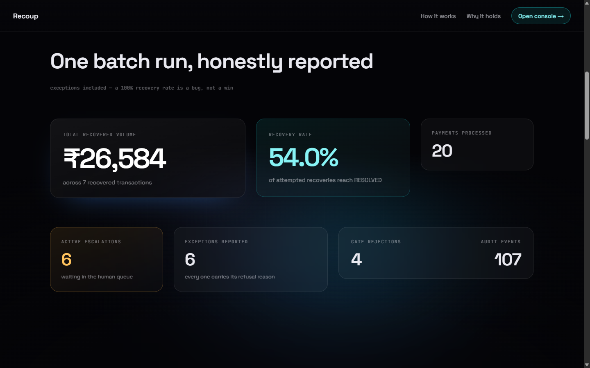
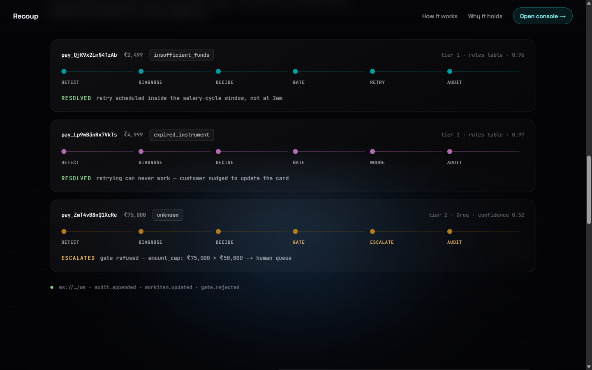
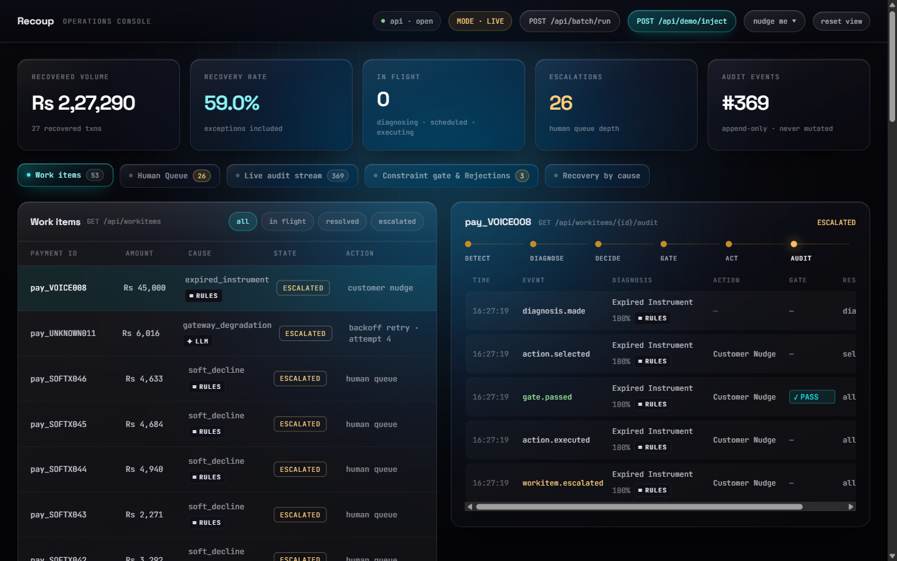
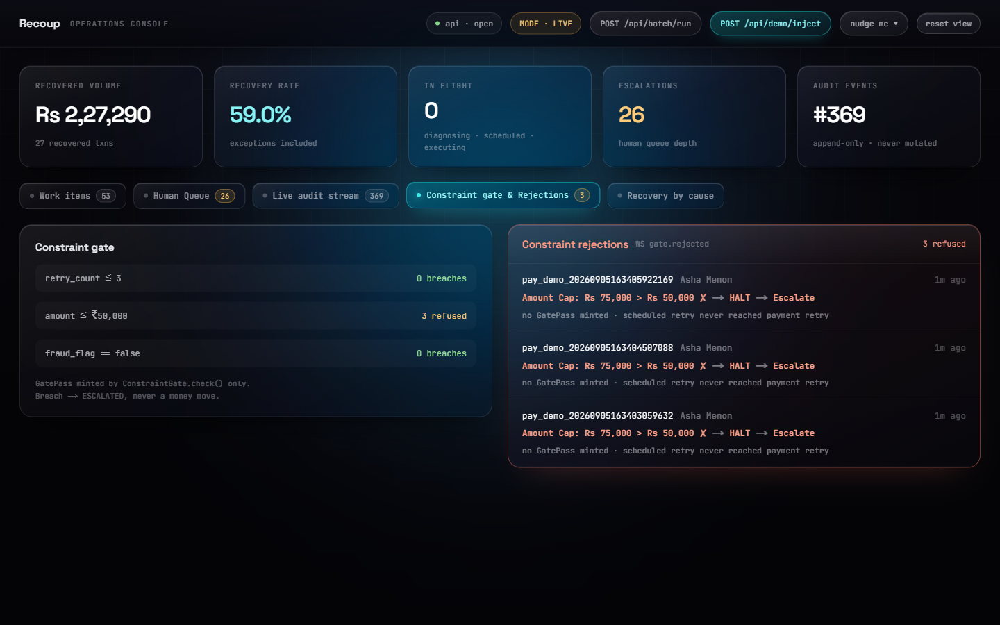
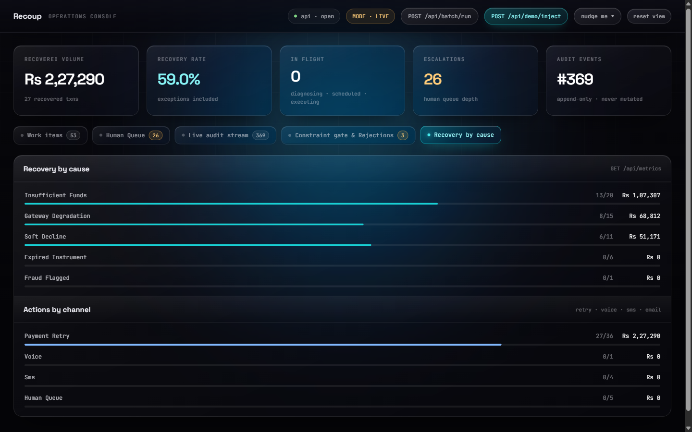
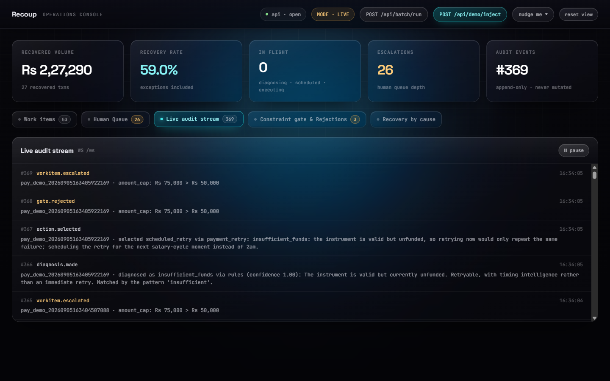
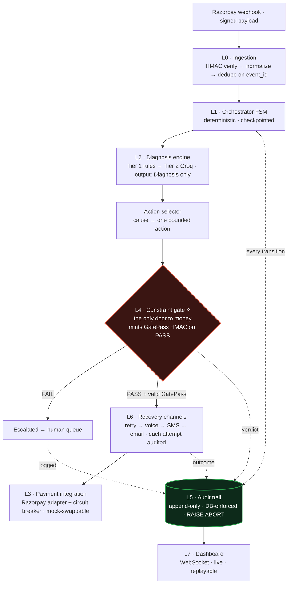
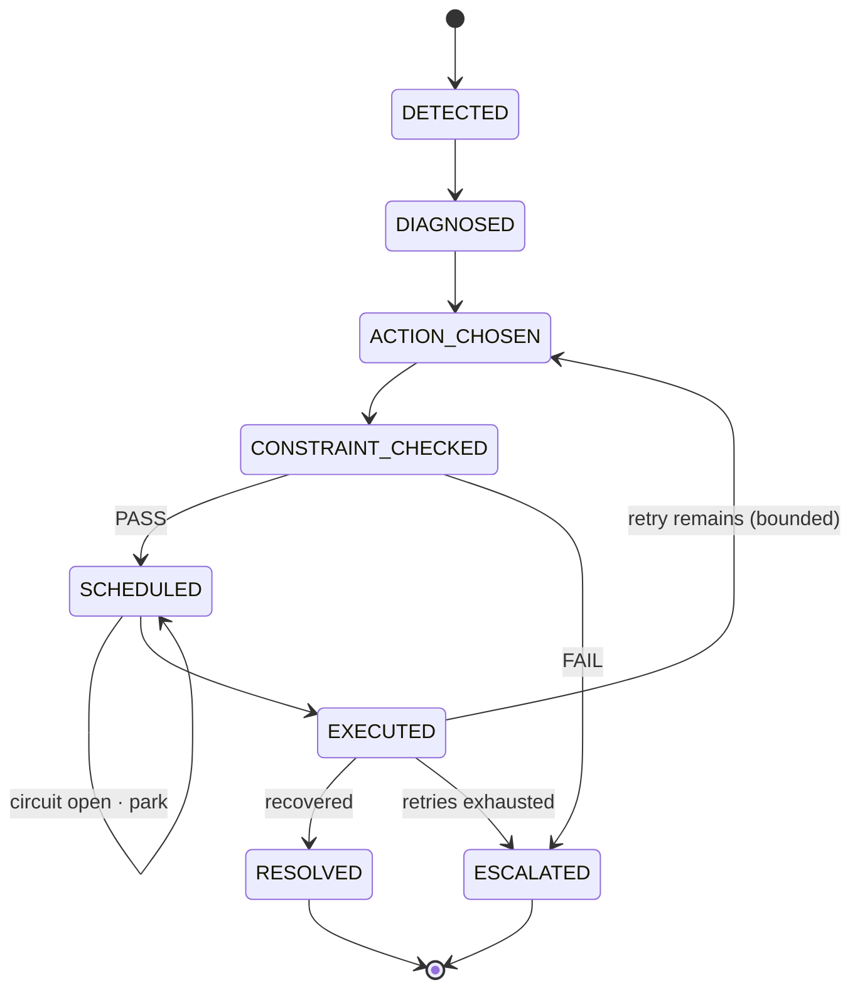

<div align="center">

# Recoup — Autonomous & Money-Safe Revenue Recovery for Razorpay

**Recovery is a state machine, not a chatbot.**
**The LLM diagnoses. The state machine decides. The constraint gate guards. The audit log proves it.**

<br/>

<!-- Integrations -->


<!-- Core stack -->


<!-- Quality -->
[](https://github.com/ishaans04/Recoup/actions/workflows/ci.yml)


</div>

<p align="center">
  
</p>

---

## Why Track 03: AI Revenue Recovery

> **Track 03 — AI Revenue Recovery:** *Find revenue that's slipping away and win it back.*

Revenue rarely leaves through the front door. It leaks in ways nobody watches:

- **Payment gateway degradation.** An issuer starts timing out for forty minutes. Every retry during that window fails, burns a retry budget, and looks like a customer problem.
- **Subscription mandate drops.** A UPI mandate is revoked or a card expires. The subscription silently stops charging. No retry will ever succeed, and most systems keep retrying anyway.
- **Soft declines.** The bank says "try again in a moment." Retried immediately, it fails again. Retried on payday, it clears.
- **Insufficient funds.** Not a failure at all — a timing problem. The money exists on the 1st and not on the 28th.

These four look identical to a naive system: `status = failed`. They demand four completely different responses.

### How Recoup satisfies "The Bar"

| Track requirement | How Recoup meets it |
|---|---|
| Detect → diagnose → intervene → recover | The full state-machine loop, eight states, every transition audited |
| **Measured** money recovered across a batch | `--n 50` batch run producing a real recovery rate, not a cherry-picked case |
| Compliant escalation | Every breach, fraud flag, or exhausted retry lands in a human queue with a reason |
| Stopping rules | Centralised in one constraint gate — nothing loops forever |
| Audit trail | Append-only, enforced by the database itself, streamed live to the dashboard |
| One failure handled gracefully | The ₹75,000 case is refused **on screen** and escalated, with no money moved |
| Not cherry-picked | Every batch report ships the full exception list, each with its refusal reason |

A 100% recovery rate would be a bug, not a win. Recoup reports the transactions it could **not** save, and why.

<p align="center">
  
</p>

---

## What Recoup solves, and how

### The problem with the standard fix

The industry default is a **blind retry loop**: a payment fails, so try it again in an hour, then three, then twelve. This is cheap to build and actively harmful.

- It **annoys customers** — three failed-payment emails for a card that expired two weeks ago.
- It **hammers degraded banks** — piling retries onto an issuer that is already timing out, making the outage worse for everyone.
- It **recovers little** — because it never asks *why* the payment failed, it applies one response to four unrelated problems.
- It **cannot be audited** — "we retried it" is not an explanation a compliance reviewer accepts.

### The Root-Cause Router

Recoup spends exactly **one bounded action per failure**, chosen from the diagnosed cause, and can prove afterwards precisely why it made that choice.

```
DETECT  ──▶  DIAGNOSE  ──▶  DECIDE  ──▶  GATE  ──▶  ACT  ──▶  AUDIT
webhook      why did it     which        may we     one       immutable
signature    fail?          bounded      do this?   action    record
verified     rules → LLM    action?      HARD CAPS  only      append-only
```

The cause determines the action:

| Cause | Action | Channel | Reasoning |
|---|---|---|---|
| `insufficient_funds` | Scheduled retry | Payment retry | Retry near the salary cycle — the 1st or month-end, clamped to 10:00–20:00 IST. Never at 2am. |
| `gateway_degradation` | Back-off retry | Payment retry | Exponential back-off behind a route-keyed circuit breaker |
| `soft_decline` | Immediate retry (once) | Payment retry | The bank asked us to try again — so try, exactly once |
| `expired_instrument` | Customer nudge | Voice → SMS → Email | No retry can *ever* succeed. Only the customer can fix this. |
| `fraud_flagged` | No action | Human queue | Never auto-actioned. Ever. |
| `unknown` | Escalate | Human queue | An honest "I don't know" beats a confident guess with someone's money |

<p align="center">
  
</p>

<p align="center"><em>Three real transactions from one batch, each walking the same six stages to a different end: a salary-cycle retry, a customer nudge, and a gate refusal.</em></p>

---

## How Recoup diverges from standard AI models

Most agentic builds are one LLM loop that calls payment APIs directly. That design cannot answer the only question that matters: *what stops it doing something catastrophic?* Recoup inverts it.

### 1. The LLM never moves money

The model's entire authority is returning a `Diagnosis`:

```python
class Diagnosis(BaseModel):
    cause: Cause  # a closed enum — six values, nothing else
    confidence: float
    rationale: str
    source: Literal["rules", "llm", "fallback"]
```

That is the whole output surface. It cannot select an action, call a channel, or name an amount. An out-of-enum cause is treated as a parse failure, not passed through. Confidence below `0.70` degrades to `unknown`, which routes to a human. **An unlucky model response cannot select an action nobody authorised.**

Tier 1 is a deterministic rules table that resolves most known Razorpay failure codes with confidence `1.0` and never calls the model at all. The LLM handles only the ambiguous tail.

### 2. Single-door enforcement — the `GatePass` HMAC

`ActionExecutor.execute()` refuses to run without a `GatePass`: a frozen dataclass carrying an HMAC token that **only** `ConstraintGate.check()` can mint.

```python
@dataclass(frozen=True)
class GatePass:
    txn_id: str
    action: Action
    checked_at: datetime
    token: str  # HMAC over txn_id|action|checked_at — unforgeable
```

A hand-constructed `GatePass` raises `GateBypassError`. A token minted for transaction A cannot execute transaction B. And this is not left to convention — `tests/architecture/test_single_door.py` walks the AST of every module under `src/recoup/` and **fails the build** if anything outside the executor imports `recoup.channels`.

You can point at one file and say: this is the only door, and this test breaks CI if anyone opens another.

### 3. Bounded escalation — no infinite loops

Hard caps the system cannot override, evaluated together so the audit log records *every* reason a thing was refused, not just the first:

| Constraint | Limit | On breach |
|---|---|---|
| `retry_cap` | `retry_count ≤ 3` | → `ESCALATED` |
| `amount_cap` | `amount_paise ≤ 5_000_000` (₹50,000) | → `ESCALATED` |
| `fraud_block` | `fraud_flag == False` required | → `ESCALATED` |
| `terminal_stop` | No action after `RESOLVED` / `ESCALATED` | Refused |
| `circuit_open` | Route breaker must not be `OPEN` | Parked in `SCHEDULED` |

All money is integer **paise**. Never floats, never rupees, until the UI divides by 100 at the last moment.

### 4. Immutable auditability — enforced by the database

The audit log is not append-only by convention. It is append-only because SQLite physically refuses:

```sql
CREATE TRIGGER audit_events_no_update BEFORE UPDATE ON audit_events
BEGIN SELECT RAISE(ABORT, 'audit_events is append-only'); END;

CREATE TRIGGER audit_events_no_delete BEFORE DELETE ON audit_events
BEGIN SELECT RAISE(ABORT, 'audit_events is append-only'); END;
```

`tests/unit/test_audit_immutability.py` issues a raw `UPDATE` and asserts the database aborts it. The state change and its audit row are written in **one transaction**, so a transition can never persist without its proof.

---

## The operations console

Everything on the console is the backend's own data, hydrated from REST and then
followed live over WebSocket — the metrics, the work items, the audit stream, the
human queue and the gate tally all move together off one sequenced feed. The five
sections below are the whole surface.

### Work items and the audit chain

Every failed payment, filterable by lifecycle, with the selected transaction's full
trail beside it: the six-stage pipeline it walked, and each transition carrying its
diagnosis, confidence, and a `RULES` / `LLM` badge — the two-tier engine made visible
rather than merely claimed.

<p align="center">
  
</p>

### The gate, seen saying no

The demo-critical panel (PRD §12.4). The three hard caps on the left, each carrying
how many times it actually refused; the refusals on the right, each reading in the
PRD's own worked shape — `Amount Cap: Rs 75,000 > Rs 50,000 ✗ → HALT → Escalate`,
`no GatePass minted`.

<p align="center">
  
</p>

### Honest metrics — recovery by cause and by channel

Two of PRD §15.1's required figures, as proportion bars with honest denominators, so
a cause that recovered one of one cannot pass for one that recovered forty of forty.
Causes the batch never saw are kept, not hidden.

<p align="center">
  
</p>

### The append-only log, live

Every `audit.appended` frame as it arrives over `/ws`, newest first, each carrying the
rationale recorded with it. The sequence number is the audit row's own id — watch it
advance and you know nothing between two ids was skipped.

<p align="center">
  
</p>

---

## Technical architecture

Seven layers, each behind an interface, assembled by a deterministic orchestrator.
The diagram is the argument in one picture: the LLM only diagnoses, one gate is the
only path to money, and every layer writes to an append-only log the database itself
refuses to rewrite.



### The state machine

Eight states. Two are terminal; a further transition out of either raises
`TerminalStateError`. The loop back to `ACTION_CHOSEN` is bounded by `retry_cap`, so
nothing can retry forever.



## Tech stack — and why we chose it

| Technology | Where it's applied | Why this one |
|---|---|---|
| **Python 3.13** (via `uv`) | Backend language, packaging, runtime | Pinned for the broadest wheel coverage; `uv` gives fast, frozen, reproducible installs (`uv sync --frozen`) |
| **Plain-Python FSM** | Orchestration (L1) | Chosen over LangGraph: explicit states, zero framework magic, a checkpoint is one DB write — it reinforces "bounded, not autonomous" rather than undercutting it |
| **FastAPI** | REST + WebSocket API (L7) | Async-native, and its OpenAPI schema lets the Next.js contract be enforced instead of hand-synced |
| **SQLAlchemy 2.0 + SQLite** | Persistence + audit log (L5) | Postgres-compatible schema with zero ops for the demo; SQLite `BEFORE UPDATE`/`DELETE` triggers make the audit log append-only at the database layer, not by convention |
| **Pydantic v2 + pydantic-settings** | Domain models, config | Validation at every boundary; the closed `Diagnosis` enum that bounds the LLM; secrets read from the environment only |
| **httpx** | Every external adapter | One async HTTP client and **no vendor SDKs**, so each integration sits behind the same seam — mockable, and testable with `respx` |
| **Groq** (`openai/gpt-oss-120b`, JSON mode) | Tier-2 diagnosis (L2) | LPU-fast, so a 50-transaction batch resolves near-instantly on stage; free tier, JSON mode, and the returned cause is validated against the enum |
| **Razorpay** (test mode) | Payment gateway (L3) | The track's platform; behind an adapter so the mock and the live client pass the *same* contract suite |
| **Twilio** (Voice + SMS) | Nudge channels (L6) | Programmable voice with TwiML `<Gather>` (press 1 → link) and SMS; callbacks are signature-verified |
| **Resend** | Email channel (L6) | A simple transactional-email API behind the same `RecoveryChannel` interface |
| **ElevenLabs** | Premium Hinglish TTS | Opt-in hero-call audio; falls back to Twilio's native TTS for cost discipline |
| **Next.js 16 + React 19 + TypeScript** | Dashboard (L7) | App-Router prerendering, typed against the API contract so drift becomes a compile error |
| **Tailwind v4** | Dashboard styling | Utility-first; drives the console's liquid-glass tokens |
| **pytest + respx** | Backend tests | Async tests with mocked HTTP; home of the load-bearing gate / audit / single-door tests |
| **Vitest + Testing Library** | Frontend tests | Fast, jsdom-based component tests |
| **ruff + mypy (strict)** | Lint, format, types | One fast linter/formatter; strict typing on the money-safe core |
| **GitHub Actions** | CI | Runs both suites, lint, format and types on every push — so the badges are truthful |

---

## What's real, and what's simulated

The money-safe core — the state machine, the constraint gate, the append-only audit
log — is **real in every mode**. Only the edges of the system, the calls that reach
the outside world, are swappable. With an empty `.env` every edge degrades to a
working mock; with credentials and `RECOUP_MODE=live` the real services are used —
always in test mode, never moving real money.

| Capability | Real (credentials + `live`) | Simulated (default / no keys) | Notes |
|---|---|---|---|
| State machine · gate · audit log | ✅ always real | — | Identical in both modes; this is the part being proven |
| Payment gateway | Razorpay test-mode API | Seeded `MockGateway` | Both pass the same contract suite |
| **Batch run** | — | **Always** seeded `MockGateway`, no channels | By construction a batch cannot call or email a real person |
| Diagnosis Tier 2 | Groq classifies the ambiguous tail | Rules only → unmatched becomes `unknown` → escalate | The LLM is invoked only when the rules table misses |
| Voice call | Real Twilio Hinglish call + keypress | Channel not built; chain falls through | Trial accounts call verified numbers only |
| SMS | Real Twilio SMS with payment link | Channel not built | |
| Email | Real Resend email | Channel not built | The sandbox sender reaches the account owner only |
| Premium voice audio | ElevenLabs MP3 | Twilio native TTS | Opt-in via `USE_PREMIUM_VOICE` |
| Webhook ingestion | Real signed Razorpay webhook (via ngrok) | `POST /api/demo/inject` | Both take the signature-verified path |
| Money movement | Razorpay **test mode** only | Mock returns scripted results | No real money in any mode |

---

## What broke, and how we fixed it

Real problems from the build, and what they taught us.

### The empty-database UI fallback

The dashboard decided "am I looking at a real backend?" with `stream.lastSeq === 0`. That works right up until the backend is running perfectly with an **empty database** — a fresh clone, or the first run after `rm recoup.db`. `last_id` is legitimately `0`, so the console showed a banner reading *"start the backend on :8000"* while the backend was answering requests on that exact port.

Worse, it fell back to the **20-transaction preview fixtures**, so the console displayed twenty invented transactions over a database holding zero. The moment a batch finished, the figures would lurch from fiction to fact.

The fix separates two genuinely different facts. `useRecoupStream` now exposes a `connected` flag, set when the REST snapshot succeeds *or* the WebSocket opens — independent of whether any rows came back. Fixtures are now reserved for the single case where nothing answered at all:

| State | What the console shows |
|---|---|
| Nothing answered | Preview fixtures, labelled honestly as such |
| Connected, zero rows | The real, empty state: *"run a batch to populate the console"* |
| Connected, rows present | Live data |

The bonus: starting from a genuine zero is what lets the recovered-volume counter **climb from ₹0** as a batch runs, instead of jumping between two datasets.

### Trial-account gateway restrictions

Twilio trial accounts only call or text **verified** numbers. Resend's sandbox sender (`onboarding@resend.dev`) only delivers to the account owner's own address. Both refuse anyone else.

Rather than special-casing this, it exercised the fallback chain that was already the design. `ChannelRouter` walks `voice → SMS → email`, and **each failed attempt is written to the audit log as its own outcome** before falling through. An unverified number produces a real, recorded, bounded failure — then the next channel is tried. If every channel fails, the item escalates carrying the full reason chain.

A failed nudge is still a recorded, bounded outcome. Channels that cannot reach a customer are never even attempted: no phone means voice and SMS are dropped from the chain before anything is dialled.

### Batch-runner channel safety

`build_batch_runner` deliberately does **not** pass `settings` into `build_recovery_runtime`. Without settings, `build_nudge_channels` is never called, and the batch registers only `PaymentRetryChannel`.

This is a safety property, not an oversight. A 50-transaction synthetic batch contains fabricated customers with fabricated phone numbers. Wiring live Twilio credentials into that run would dial real strangers. The batch also always uses a seeded `MockGateway` regardless of `RECOUP_MODE`, because synthetic transaction IDs do not exist at Razorpay and calling the live API with them would produce nothing but errors.

**A batch run cannot place a call, send an SMS, or send an email — by construction.** Real nudges flow only through the main runtime, which receives settings and reaches real people.

---

## Repository layout

A flat repo: the Python package and the Next.js app share one root.

```
Recoup/
├── src/
│   ├── recoup/                 # backend package (Python 3.13)
│   │   ├── domain/             # enums + Pydantic models (WorkItem, Diagnosis, Action…)
│   │   ├── ingestion/          # signature verify · normalize · idempotency
│   │   ├── fsm/                # states · machine · orchestrator
│   │   ├── diagnosis/          # rules table + Groq client (the two-tier engine)
│   │   ├── policy/             # cause→action selector · retry timing · channel policy
│   │   ├── constraints/        # rules + ConstraintGate (the only door)
│   │   ├── execution/          # ActionExecutor (requires a GatePass)
│   │   ├── gateways/           # PaymentGateway: mock + Razorpay + circuit breaker
│   │   ├── channels/           # retry · voice · SMS · email · router · factory
│   │   ├── storage/            # SQLAlchemy tables · append-only audit · repo
│   │   ├── batch/              # synthetic generator + batch runner
│   │   ├── api/                # FastAPI app · webhooks · routes · ws · voice
│   │   ├── runtime.py          # the one sanctioned channels-importer
│   │   └── clock.py · money.py · events.py · metrics.py · config.py
│   ├── app/                    # Next.js App Router — landing (/) and /console
│   ├── components/             # console/ + landing/ React components
│   └── lib/                    # API client · WebSocket hook · types · fixtures · formatters
├── tests/                      # unit · integration · contract · architecture
├── docs/                       # interface contract · setup guides · screenshots
├── .github/workflows/ci.yml    # backend + dashboard CI
├── prd.md · changelog.md       # the binding spec + the drift log
├── pyproject.toml · uv.lock    # backend dependencies
└── package.json                # frontend dependencies
```

The backend is 65 Python modules under `src/recoup/` with 44 test files across four
suites; the dashboard is 22 React components under `src/`.

---

## Local setup & running

### Prerequisites

| Requirement | Version |
|---|---|
| Python | 3.13 |
| [uv](https://docs.astral.sh/uv/) | latest |
| Node.js | 22+ |

### 1. Install

```bash
git clone https://github.com/ishaans04/Recoup.git
cd Recoup

uv sync          # backend dependencies
npm install      # dashboard dependencies
```

No `.env` is required. With an empty environment the app boots into mock mode and the full test suite passes.

### 2. Run the backend

```bash
uv run uvicorn recoup.api.app:app --port 8000
```

API docs at `http://localhost:8000/docs`, health at `/api/health`.

### 3. Run a batch (headless, no frontend needed)

```bash
uv run python -m recoup.batch --n 50 --seed 42 --report
```

Deterministic under a fixed seed. Prints the recovery rate, the by-cause and by-channel breakdowns, and the **full exception list with reasons**. Add `--json` for machine-readable output.

### 4. Run the dashboard

```bash
npm run dev
```

Open `http://localhost:3000`, then **Open the live console**.

### 5. Trigger the safety-gate demo

```bash
curl -X POST http://localhost:8000/api/demo/inject \
  -H "Content-Type: application/json" \
  -d '{}'
```

Injects the ₹75,000 case. The gate refuses it before any channel is reached, and the console shows:

```
Amount Cap: Rs 75,000 > Rs 50,000  ✗  →  HALT  →  Escalate
```

No `GatePass` is minted. No money moves. The item lands in the human queue with its reason attached.

---

## API keys & credentials

**Every key is optional.** With an empty `.env` the app boots, the dashboard runs, and all 515 backend tests pass — each integration degrades to a working mock rather than crashing.

| Variable | Purpose | Without it |
|---|---|---|
| `RECOUP_MODE` | `mock` or `live` — selects the payment gateway | Defaults to `mock` |
| `GROQ_API_KEY` | Tier-2 diagnosis for ambiguous failure codes | Rules tier only; unmatched codes → `unknown` → escalate |
| `RAZORPAY_KEY_ID` | Test-mode API key | `MockGateway` is used |
| `RAZORPAY_KEY_SECRET` | Test-mode API secret | `MockGateway` is used |
| `RAZORPAY_WEBHOOK_SECRET` | HMAC verification on inbound webhooks | Webhook endpoint rejects everything |
| `TWILIO_ACCOUNT_SID` | Voice + SMS account | Voice and SMS channels are not built |
| `TWILIO_AUTH_TOKEN` | Voice + SMS auth, and callback signature checks | Voice and SMS channels are not built |
| `TWILIO_PHONE_NUMBER` | The number calls and texts originate from | Voice and SMS channels are not built |
| `RESEND_API_KEY` | Transactional email | Email channel is not built |
| `ELEVENLABS_API_KEY` | Premium Hinglish TTS for the hero call | Falls back to Twilio's native TTS |
| `PUBLIC_BASE_URL` | Public URL (e.g. ngrok) Twilio fetches TwiML from | Voice channel is not built |
| `USE_PREMIUM_VOICE` | Opt-in to ElevenLabs audio | Defaults to `false` — cost discipline |

Secrets are read from the environment only, never committed, and never logged. `.env` is gitignored; `.env.example` documents every key.

---

## Security & guardrails

Recoup is built defense-first: it recovers legitimately owed revenue through
compliant channels, in test mode, and can prove every decision after the fact.

| Control | How it's enforced |
|---|---|
| **Webhook signature verification** | Every inbound Razorpay webhook and every Twilio callback is HMAC-verified (constant-time) **before any parsing**; an unsigned or wrong-secret payload never reaches the normalizer |
| **Idempotency** | Ingestion dedupes on `event_id`, so a webhook delivered twice never starts a second recovery or a duplicate money action |
| **No secrets in code** | Every credential is read from the environment only; `.env` is gitignored, `.env.example` is committed, and keys are never logged or included in a repr |
| **Bounded autonomy** | Hard caps (`retry_count ≤ 3`, `amount ≤ ₹50,000`, `fraud_flag == false`) the system cannot override, enforced centrally at one gate |
| **The LLM cannot move money** | The model's only output is a `Diagnosis`; a malformed or out-of-enum response degrades to `unknown` → human, never to an action |
| **Single door** | `ActionExecutor` requires an HMAC `GatePass` that only `ConstraintGate.check()` can mint; an AST test fails the build if any other module imports a channel |
| **Immutable audit** | `audit_events` rows can be inserted but never updated or deleted — SQLite triggers `RAISE(ABORT)` on either |
| **Human-in-the-loop** | Anything above a cap, fraud-flagged, or retry-exhausted is escalated to a human queue, never auto-actioned |
| **Test mode only** | No production credentials; no real money moves in any mode |

---

## Testing & quality

```bash
uv run pytest -q                       # 515 backend tests
uv run ruff check . && uv run ruff format --check .
uv run mypy src                        # strict
npm test                               # dashboard tests
```

### The load-bearing tests

These four are the ones that make the safety claims provable rather than rhetorical:

| Test | What it proves |
|---|---|
| `tests/architecture/test_single_door.py` | AST-walks every module; **fails the build** if anything outside the executor imports `recoup.channels` |
| `tests/unit/test_audit_immutability.py` | Issues a raw `UPDATE` and a raw `DELETE` against `audit_events`; the database aborts both |
| `tests/unit/test_constraints.py` | Every constraint, pass and fail; a forged `GatePass` raises `GateBypassError`; a token for txn A cannot execute txn B |
| `tests/contract/test_payment_gateway.py` | One conformance suite run against **both** `MockGateway` and `RazorpayGateway` — proof the adapter boundary is real |

Plus `tests/unit/test_fsm_states.py`, which asserts illegal transitions raise and write nothing, and that terminal states refuse all further transitions.

CI runs the backend suite, ruff, `ruff format --check`, mypy strict, and the dashboard build and tests on every push.

---

## License

MIT — see [LICENSE](LICENSE).
